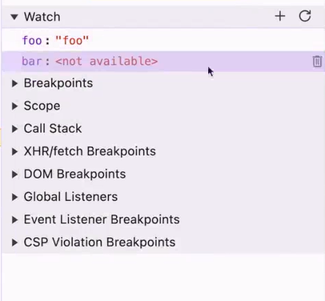
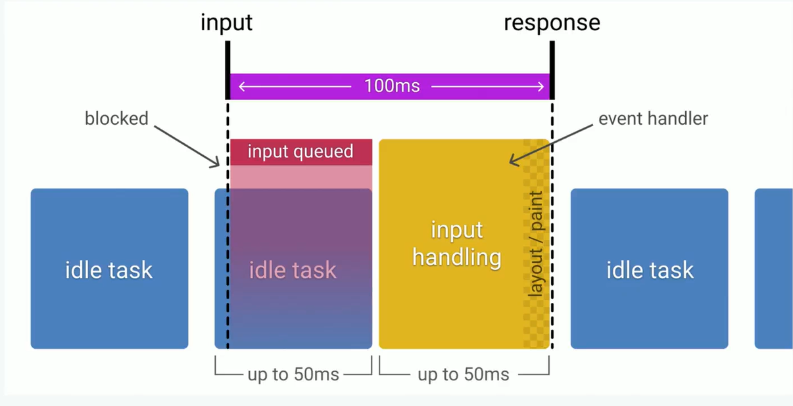
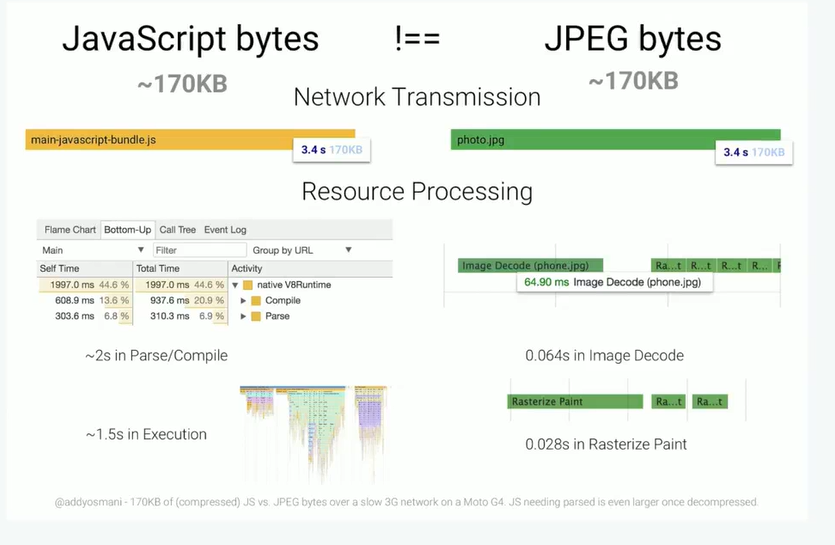
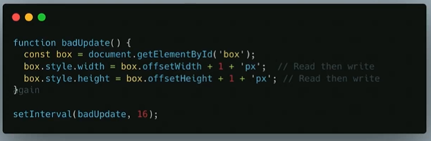
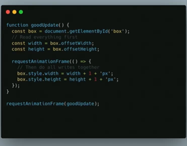
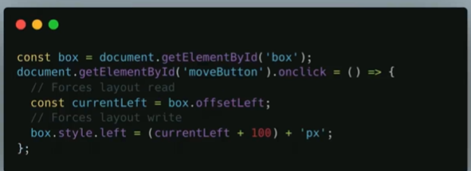
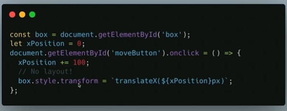

## Why master Chrome DevTools ?

- Become a web performance expert!
- Be the one your team to fix complicated bugs
- Prototype quickly with live editing

## Google Performance Studies

## Speed Update

in recent google changes having hight speed can boost you website ranking

## How do we measure performance ?

### LCP

Largest Content Paint : they monitor how your website load and find the largest paint on your
content. It find the biggest block that kind of have some content and see how long that takes to painting.

### INP

Interaction Next Pain : if some body interact click button add card and etc search or what ever how long dose it  
takes pain like if I open card show spinner and take 7s and then go into next page that 7s will count as INP.

### CLS

Cumulative Layout Shift : how stable you UI do things and moving things around. poor load can cause by all of sudden a
image load and change entire page or ads comes form third party library.

## RAIL

### Response

if you click some or what ever how you app response to that is it fast or slow .

### Animation

what is animated and how smooth is it how fast is it.

### Idle

when do open operation you app show be Idle not friz and wait to that to finish.

### Load

how dose it takes to page to load or action to load and stuff like that.

## What can Chrome DevTools Do ?

> Chrome extensions often mess with the DevTools data, leading to inaccurate reporting. if you're going to run any important
> audits , make sure you have all of your extensions disabled or use an incognito tab!

basic of element tab and styles and computed nothing special

### Element

a full structure of you html you can edit fully and change what ever you want in html

#### Styles

here you can see all the styles coming and also in **:hov** section simulate different types of actions
like hover and etc

##### **:cls**

This one is used for adding class

##### **brush**

by clicking this you can set what if user preference was dark or light and see the change based on that

#### Computed

This section show the box mode of the selected element and all styles attach to that

#### Event Listeners

to see the event are running on that exact element

### Network

#### files

you shit through files in files in network to see where it come from and by clicking in each file
you get more info about status repose and etc .

by clicking into each file you have more info on it like remove cash , block that things and etc

> Tip: for running devtool separate that into another screen because when it's on bottom it's contain and block that view Prototype

#### Top bar

at there you can customize the internet connection , disable cashing and etc.

#### The bottom info

the most information are in the bottom things like the amount of requests , transformed , time to finish , load and etc.

### Performance

In here you mostly focus what is the main thread is actually doing.
for things like using the 3D or heavy animation the GPU matter and you can check that

at bottom it is indicated that what each color is representing.

### Console

a place where you can write math , code and execute some operation on page directly

### Source

this is basically a full IDE but section is like go away because now a days all new projects
have bundler and all of the code are not readable and easy to change

Also there is Content Script which mostly used for dose develop extension and they can see more info in here
is it like manifest file but for extensions

### Application

all other things like Cookie , local storage and session storage and all other sort data that store.

### Memory

It will mostly use for C , C++ and assembly to see how much data Memory each wants to use.

### Lighthouse

here you can simulate lot's of things like

- Performance
- Accessibility
- Best Practice
- SEO

for Mobile and Desktop

## Before Chrome DevTools

before dev tools you open up source of page and you debug like that. also another way that
at that time people used is put the value in the alert to see

## Essential Chrome DevTools

### Element

- Edit the styles
- Edit html tags
- Edit html Properties
- adding multiply css rules
- scroll into view where if you select code and right click and click scroll on view move your scroll into that section
- Delete and hide and show elements or duplicated
- simulate many state like hover , active and etc ...
- simulate color scheme preference
- in computed tab see box Model and all styles apply to selected element
- HTML breakpoint click on element and active this and will show which js case to change that html
- finding event listers in separate tab
- Accessibility for color contrast and font size

## Network optimization

## Browser caching

## Gzip vs Brotli

two type of comparison for file that helps to load the size faster rather reduce the code or change any line of
code in total for fullstack app this way this recommended.

## Preload vs Prefetch

this are some browser API that tells which files are more priority and which one is not.
you do file or entire page.

## HTTP/2 vs HTTP/3

## Lighthouse web audits

### Performance

- Page load speed and responsiveness.
- Resources usage (e.g., javascript, images,fonts).
- Metrics:
  - First Contentful Paint (FCP): Time to first visible content.
  - Large Contentful Paint (LCP): Time to load the largest visible element.
  - Cumulative Layout Shift (CLS) : Visual stability during loading.
  - Time to Interactive (TTI) : Time until the page is fully usable.
  - Total Blocking Time (TBT) : Delays caused by scripts.

### Accessibility

- Compatibility with assistive technologies (e.g , screen readers).
- Semantic HTML structure and correct use of ARIA roles.
- Key focus areas:
  - Text contrast ratio.
  - Keyboard navigation support.
  - Alt attributes on image.
  - Labels on forms and interactive elements.

### Best Practices

- Code quality and security practices.
- Key areas:
  - Secure HTTPS connections.
  - Avoiding deprecated APIs.
  - No inline style or Javascript (avoid XSS risks).
  - Efficient use of browser features (e.g, modern image formats like WebP)

### SEO

- Basic search engine optimization for discoverability.
- Key areas:
  - Meta tags.
  - Page can be crawled by SEO bots.
  - Mobile-friendliness.
  - Correct use of HTTP status codes.

> in the dev tool click on escape you will see the console then click on the menu and add coverage to see better

## Step through Debugging

### Core Concepts

- Stop / Start
- Step Into
- Step Over
- Step
- Not time traveling!

- **Watch :** that you can add value into that section and see the access section of it.
- **Call Stack :** It will show how you get there
- **Scope :** It show that where your this is referring
- **Breakpoint :** where you can set by editor or in your code write debugger to stop that area

> by right clicking on the line also you can add condition breakpoint that stop when condition hit.

## Performance Profiling

red in the performance mean page junge which is mean the css are too heavy in which refresh browser want more
and more and the thread is too busy and it drop the frame.

> The problem for lack in games is that the Thread is too busy and monitor ask for paint and thread can't provide that.

**0 to 16ms** Users are exceptionally good at tracking motion, and they dislike it when animations
aren't smooth. They perceive animations as smooth so long as 60 new frames are rendered every
second. That's 16 ms per frame, including the time it takes for the browser to pain the new frame
the screen , leaving an app about 10 ms to produce a frame.

**60 to 100ms** Respond to user actions within this time window users fell like the result is
immediate. Any longer , and connection between action and reaction is broken.

**100 to 1000ms** Within this window, things feel part of a natural and continuous progression of
tasks. For most users on the web, loading pages or changing views represents a task.

**1000 ms more** Beyond 1000 milliseconds (1 second), users lose focus on the task they are performing.

**10000 ms or more** Beyond 10000 milliseconds (10 second), users are frustrated and are likely to
abandon tasks. They may or may not come back later.

## Javascript Bytes are not same as JPEG bytes

## Page Jank

Most devices today refresh their screens 60 times a second. The browser needs to match the device's
refresh rate and put up 1 new picture , or frame , for each of those screen refreshes.

Each of those frames has a budget of just over 16ms (1second / 60 = 16.66ms). In reality, however,
the browser has housekeeping work to do , so all of your work needs to be complicated inside 10ms.

## Request Animation Frame

instead of doing it manually you use this library to make it faster

## CSS Transform

you can optimize that like this :

## Memory

### Memory Leak 1 - global Variables

### Memory Leak 2 - Closures

### Memory Leak 3 - Zombie event listeners

### Memory Leak 4 - Never Cleared Intervals

### Memory Leak 5 - Detached DOM Nodes

## Checking Memory

One approach is opening hamburger menu in chrome and then more tools and task manager 
at there you can see the tabs how much of memory get and what are they doing monitor from their

Second way is using performance chrome dev tools and by clicking memory that give more info too

Third is the Memory tab in dev tools 

### Memory Tab in Dev tools 

**Shallow Size** how much the item big it is 
**Retained Size** how much memory will free if we remove that 

The best approach is create two snapshots and compare them with each others

> But you don't exact access to see where dose memory leak happened at your code you have to search by your own.

you can improve you chrome by opening the experiments and add some hidden features

## AI assists

for now there is two option first is that explain the chrome console error and suggest some way to fix it.

the second one is that in element when you click chat icon it's aware of your code and it's like Chat GPT but aware of you contents 
and ask some question about it with it this feature in beta for all other places.

